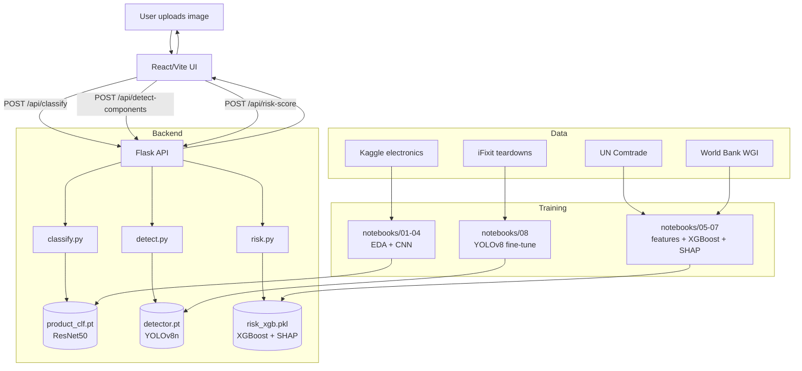
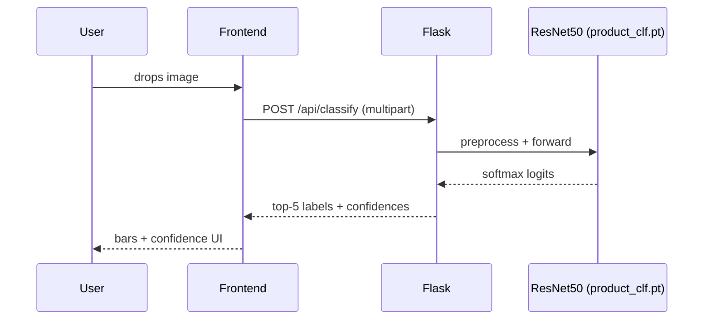

# Architecture Diagram

```mermaid
flowchart TB
    U[User uploads image] --> FE[React/Vite UI]
    FE -->|POST /api/classify| API[Flask API]
    FE -->|POST /api/detect-components| API
    FE -->|POST /api/risk-score| API

    subgraph Backend
        API --> R1[classify.py]
        API --> R2[detect.py]
        API --> R3[risk.py]
        R1 --> M1[(product_clf.pt<br/>ResNet50)]
        R2 --> M2[(detector.pt<br/>YOLOv8n)]
        R3 --> M3[(risk_xgb.pkl<br/>XGBoost + SHAP)]
    end

    subgraph Training
        NB1[notebooks/01-04<br/>EDA + CNN] --> M1
        NB2[notebooks/05-07<br/>features + XGBoost + SHAP] --> M3
        NB3[notebooks/08<br/>YOLOv8 fine-tune] --> M2
    end

    subgraph Data
        D1[UN Comtrade] --> NB2
        D2[World Bank WGI] --> NB2
        D3[Kaggle electronics] --> NB1
        D4[iFixit teardowns] --> NB3
    end

    API --> FE
    FE --> U
```

## Request → response for `/api/classify`

```mermaid
sequenceDiagram
    participant U as User
    participant FE as Frontend
    participant API as Flask
    participant M as ResNet50 (product_clf.pt)

    U->>FE: drops image
    FE->>API: POST /api/classify (multipart)
    API->>M: preprocess + forward
    M-->>API: softmax logits
    API-->>FE: top-5 labels + confidences
    FE-->>U: bars + confidence UI
```
